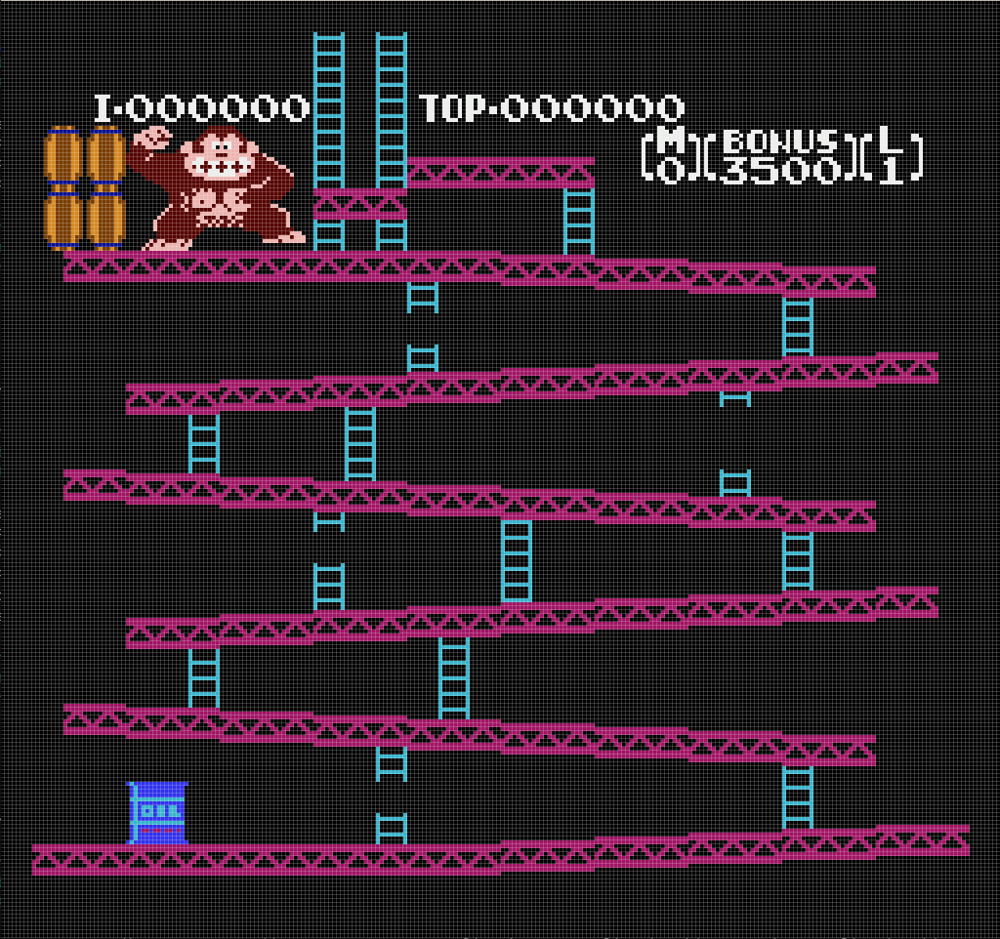
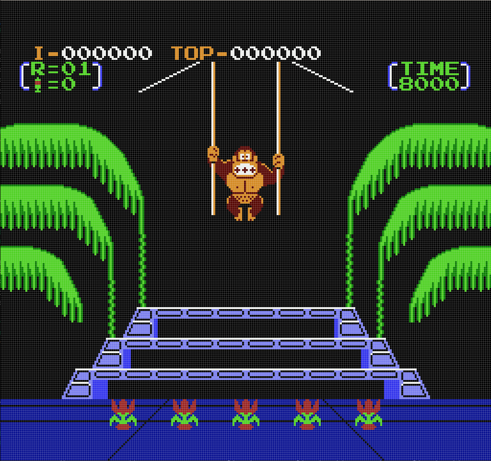

# NES Emulator

Nintendo Entertainment System (NES) Emulator writen in Rust

This project is under development and it's still far to be a full emulator.
Although, any contribution is welcome.


## Features

### Done

- CPU (MOS6502) emulated
- Memories (RAM, ROM and mirrored RAMs)
- Buses
- GTK4 GUI capable to render frames
- Partial Maper-0 support
- PPU (Picture Processing Unit) background rendering

### Work in progress

- PPU (Picture Processing Unit) sprite rendering
- Mapper-0 suppot
- Support more mappers

### TODOs and ideas

- APU (Audio Processing Unit)
- Web interface (compiling to web assembly)


## Run nes-emulator

### Dependencies

#### GTK-4 Graphical interface

When using GTK-4 desktop application to render NES screen, GTK-4 library is
needed. To install the necessary dependencies, refer to [GTK-4 Rust bindings
documentation](https://gtk-rs.org/gtk4-rs/stable/latest/book/installation.html).
For Linux users based on Debian and derivates, install the following libraries:
- libgtk-4-dev
- build-essential

### Run nes-emulator binary

*nes-emulator* can be run with:
``` bash
cargo run --release
```

For the moment, it'll run a binary with a hardcoded path to a cartidge. Open
*src/main.rs* and change the path to load you NES game.

NES games must be in iNES file format.

### Run examples

There's some useful examples to look at in the *examples/* folder. They can be
run with:
``` bash
cargo run --example <EXAMPLE>
```

Some of the examples point to a ROM which is not part of the repository. If
that's the case, download a ROM and change the cartidge path in the example.


## Test nes-emulator

To run *nes-emulator* tests, execute:

``` bash
cargo test
```


## Debugging

*nes-emulator* library uses logging as observability/debugging tool. Some
modules can export verbose logs, so it's recommended to customize `RUST_LOG` to
print only the logs needed.

For example, to log CPU instructions being executed, run with `RUST_LOG="nes_emulator::processor::cpu=DEBUG"`


## Screenshots

Let's see some nice screenshots of things working right now :)

Donkey Kong:


Donkey Kong 3:


Ice Climber:


## Contributing

Contributions are more than welcome. However, to make code more standard,
[`pre-commit`](https://pre-commit.com/) is used. Please, install it and run it
before submitting any code to this repo. Thanks!

To install the `pre-commit` hooks, execute:

``` shell
pre-commit install
```
